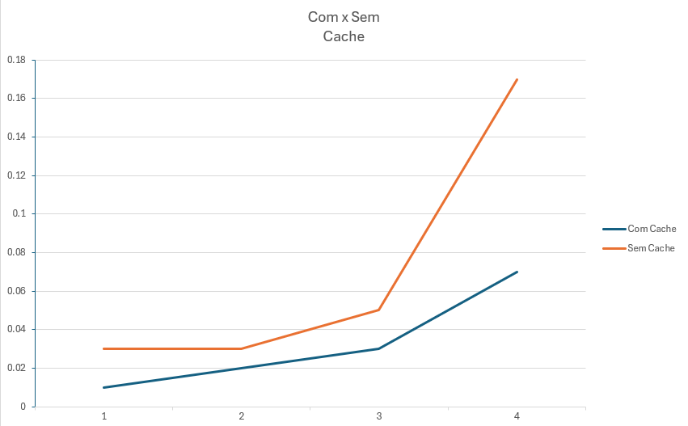

<h1>Resultado</h1>

<h4>No gráfico a cima, podemos ver a diferença de usar ou não o cache.</h4>

<h4>Podemos notar que ocorrerram quatro testes, sendo respectivamentes com 1, 10, 100 e 1000. Com os resultados visuais, podemos notar que quando se utiliza o cache o tempo de resposta é mais rapido, uma vez que ele armazena os dados anteriores e não necessita refazer tudo novamente como o "sem cache"</h4>

